# Online Retail Customer Analytics

**A Python-based end-to-end analytics covering data cleaning, EDA, cohort retention, RFM segmentation, K-Means clustering, and logistic regression for cancellation prediction.**

[Dataset Source: UCI Machine Learning Repository – Online Retail II](https://archive.ics.uci.edu/dataset/502/online+retail+ii)

---

## Business Context

A UK-based online gift retailer wants to understand its customers better: who buys, who comes back, who is about to churn, and who is cancelling orders before they ever convert into revenue. Using a sample of December 2010 transactions, this project answers four questions a retail analytics or growth team would actually ask:

1. What does a typical order and customer look like?
2. Are customers coming back after their first purchase?
3. Which customers are most valuable, and can they be grouped automatically?
4. Can we predict — and therefore prevent — order cancellations before they happen?

Each question is tackled as its own analytical module, using a consistent cleaned dataset, so the project reads as a single connected investigation rather than five disconnected notebooks.

---

## Tech Stack

| Stage | Tools |
|---|---|
| Data Cleaning | Python, pandas, NumPy |
| Exploratory Data Analysis | pandas, matplotlib, seaborn |
| Cohort Analysis | pandas, matplotlib, seaborn |
| Customer Segmentation | pandas, scikit-learn (KMeans, StandardScaler) |
| Cancellation Prediction | scikit-learn (Logistic Regression) |

This project is part of a tool-agnostic portfolio. The same business questions (funnel behavior, customer value, retention) are explored independently in SQL and Tableau in a companion repository — this project intentionally uses a different dataset (Online Retail II, UCI) so the two showcase distinct skill sets rather than duplicate work.

---

## Repository Structure

```
├── /python                                        # Full Python Source Code (6 files)
├── OnlineRetail-DataCleaningFinal.ipynb        # Cleaning, standardization, type handling
├── EDA.ipynb                                   # Distributions, order status, AOV, peak hours
├── CohortAnalysis.ipynb                        # Weekly retention cohorts
├── RFMSegmentationandKMeansClustering.ipynb     # Rule-based RFM + unsupervised clustering
├── CancellationPatterns.ipynb                  # Who/what/when of cancellations
├── LogisticRegression.ipynb                    # Predicting cancellation risk
├── /charts                                        # Exported PNG visualizations (13 charts)
│   ├── 01_quantity_price_distribution.png
│   ├── 02_order_status_breakdown.png
│   ├── 03_hourly_order_distribution.png
│   ├── 04_orders_per_customer.png
│   ├── 05_average_order_value.png
│   ├── 06_cohort_retention_heatmap.png
│   ├── 07_cohort_sizes.png
│   ├── 08_average_retention_curve.png
│   ├── 09_rfm_segment_counts.png
│   ├── 10_kmeans_clusters.png
│   ├── 11_top_cancel_customers.png
│   ├── 12_top_cancel_products.png
│   └── 13_daily_cancellation_trend.png
└── README.md
```

---

## 1. Data Cleaning

**Source:** Online Retail II, Year 2010–2011 sheet, filtered to the 2010 portion and randomly sampled to 10,000 transaction lines (`random_state=42`) for a manageable, reproducible working set.

**Issues found and resolved:**

- **Duplicates:** 25 fully duplicated rows dropped.
- **Cancelled orders:** Invoices prefixed with `C` (153 rows) were flagged into a new `Order_Status` column (`Cancelled` vs `Completed`) rather than being deleted — preserving them as a feature, not noise, for later cancellation modeling.
- **Stock code inconsistencies:** Mixed-case codes (e.g. `84559a`) standardized to uppercase. Non-product codes (`POST`, `D`, `M`, `C2`, `AMAZONFEE`, `DOT`, `gift_0001_50/40`) mapped to readable labels (Postage Fee, Discount, Manual Adjustment, Special Carriage Fee, Platform Fee, Dotcom Overhead, Gift Voucher).
- **Descriptions:** Junk values (`?`) dropped; ALL-CAPS descriptions converted to title case for readability; 25 missing descriptions filled as `Unknown`.
- **Customer ID:** 3,666 missing values (guest/unidentified transactions) retained and filled as `0` rather than dropped, since they still represent real revenue and order volume.
- **Country:** `EIRE` renamed to `Ireland` for clarity.
- **Type enforcement:** Invoice cast to numeric, dates parsed to `datetime64`, Customer ID cast to nullable `Int64`.
- **Derived columns:** `Invoice_Date_Only` and `Week_Beginning` added to support time-based aggregation in later notebooks.

**Result:** 9,974 clean transaction rows, exported as a single CSV consumed by every downstream notebook — ensuring all five analyses work from one consistent source of truth.

**Code snippet — flagging cancelled orders and standardizing stock codes:**

```python
#Droping Duplicates
df.duplicated().sum()
df.drop_duplicates(inplace=True)

# Cancelled invoices are prefixed with 'C' — flag instead of deleting
invoice_letter = df['Invoice'].astype(str).str.contains('[a-zA-Z]', regex=True)
df['Order_Status'] = np.where(invoice_letter, 'Cancelled', 'Completed')

# Strip the letter prefix once the status is captured
df['Invoice'] = df['Invoice'].astype(str).str.extract(r'(\d+)')

# Map non-product stock codes to readable labels
stock_letter = df['StockCode'].astype(str).str.contains('[a-zA-Z]',regex=True)
type_mapping = {
    'M': 'Manual Adjustment', 'POST': 'Postage Fee', 'C2': 'Special Carriage Fee',
    'AMAZONFEE': 'Platform Fee', 'D': 'Discount', 'DOT': 'Dotcom Overhead',
    'gift_0001_50': 'Gift Voucher', 'gift_0001_40': 'Gift Voucher'
}
df['StockCode'] = df['StockCode'].replace(type_mapping)

#Description Cleaning -- dropping rows with '?', formatting all capital words to title and filing nulls with 'Unknown'
junk=df['Description'].astype(str).str.contains(r'^[?_\-:]+$',na=False)
junk_index=df[df['Description']=='?'].index
df=df.drop(index=junk_index)

is_upper=df['Description'].apply(lambda x:isinstance(x,str) and x.isupper())
df.loc[is_upper,'Description']=df.loc[is_upper,'Description'].str.title()

df['Description'] = df['Description'].fillna('UNKNOWN')
df['Description']=df['Description'].replace('UNKNOWN','Unknown')

#Handling Customer ID nulls
df['Customer ID']=df['Customer ID'].fillna(0)

#Replaced 'EIRE' Country name
df['Country'] = df['Country'].str.replace('EIRE', 'Ireland')

#Derived Columns - Invoice_Week_Only and Week_Beginning
df['Invoice_Date_Only']=df['InvoiceDate'].dt.date
df['Week_Beginning']=df['InvoiceDate'].dt.to_period('W').dt.start_time
```

**Full Python Code:** 
For the complete data pipeline, interactive charts, and step-by-step execution, refer to the
*[View Full Jupyter Notebook Code](python/OnlineRetail-DataCleaningFinal.ipynb)

---

## 2. Exploratory Data Analysis

**Dataset snapshot (December 1–23, 2010):**

| Metric | Value |
|---|---|
| Transaction lines | 9,974 |
| Unique invoices | 1,436 |
| Unique customers | 833 |
| Unique products | 2,032 |
| Completed orders | 9,821 (98.5%) |
| Cancelled orders | 153 (1.5%) |

**Project Intent & Core Business Rationale**

The core goal of this analysis was to parse a newly cleaned baseline of raw transactional logs (spanning December 1 to December 23, 2010) to diagnose dynamic retail activities, pinpoint structural customer behaviors, and convert tabular records into structural corporate indicators.

Specifically, this exploratory phase establishes data checkpoints and tests structural hypotheses necessary for driving two downstream production tracks:

Targeted Engagement Windows: Spotting operational bottlenecks, calculating line-item financial weight via custom revenue variables, and discovering peak order hourly velocities to drive promotional timing.

Predictive Cohort & Segment Construction: Quantifying the explicit breakdown between one-time customer impressions and loyal repeat accounts. This directly anchors the business rationale for following up with a Time-Based Cohort Retention Analysis and an RFM (Recency, Frequency, Monetary) Customer Segmentation System.

**Key findings:**

- **Order value is right-skewed:** Average Order Value averages £152, but the median is just £63 — a small number of large bulk/wholesale orders (max £13,541) pull the mean well above what a typical customer spends.
- **Peak ordering hour is 15:00 (3 PM)**, suggesting afternoon browsing/purchase behavior — relevant for timing email campaigns or flash promotions.
- **Customer loyalty split:** 69.9% of customers were one-time buyers in this window, while 30.1% placed repeat orders — meaning roughly 7 in 10 customers acquired in a given period don't return without intervention, which sets up the retention question explored next in cohort analysis.
- Both Quantity and Price are heavily right-skewed, consistent with a B2B/wholesale-influenced gift retailer where most purchases are small but a minority of bulk buyers skew the averages.

**Code snippet — one-time vs. repeat buyer split:**

```python
#One-time vs. repeat buyer split
orders_per_customer = (
    df.groupby('Customer ID')['Invoice']
      .nunique()
      .reset_index(name='num_orders')
)

one_time = (orders_per_customer['num_orders'] == 1).sum()
repeat = (orders_per_customer['num_orders'] > 1).sum()
total = len(orders_per_customer)

print(f"One-time buyers : {one_time}  ({one_time/total:.1%})")
print(f"Repeat buyers   : {repeat}  ({repeat/total:.1%})")

#Financial Distribution & Outlier Aggregations Plotting Logic
# Isolating order values per unique invoice
aov = df.groupby('Invoice')['Revenue'].sum().reset_index(name='order_value')

# Instantiating visualization canvas grid layout
fig, axes = plt.subplots(1, 2, figsize=(10, 4))
fig.suptitle('Average Order Value Distribution', fontsize=10, fontweight='bold')

# Filtering extreme bulk-purchase outliers at the 95th percentile
aov_95 = aov['order_value'].quantile(0.95)
aov_filtered = aov[aov['order_value'] <= aov_95]['order_value']

# Subplot 1: Kernel Density Estimation & Value Distribution Histogram
sns.histplot(aov_filtered, bins=40, kde=True, color='teal', ax=axes[0])
axes[0].set_title('Order Value Distribution')
axes[0].set_xlabel('Order Value (£)')
axes[0].set_ylabel('Number of Orders')

# Subplot 2: Structural Spread Boxplot (Excluding Outliers)
sns.boxplot(y=aov_filtered, color='teal', ax=axes[1], width=0.5, showfliers=False)
axes[1].set_title('Order Value Spread')
axes[1].set_ylabel('Order Value (£)')

plt.tight_layout()
plt.savefig('charts/05_average_order_value.png', bbox_inches='tight')
plt.show()
```

**Visuals:**

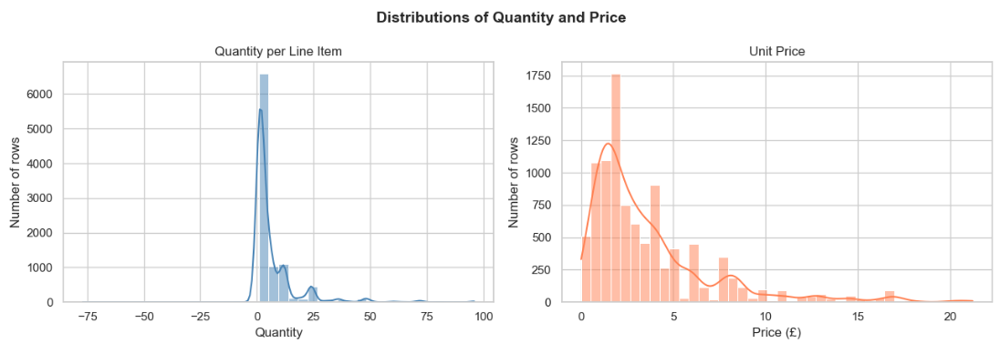
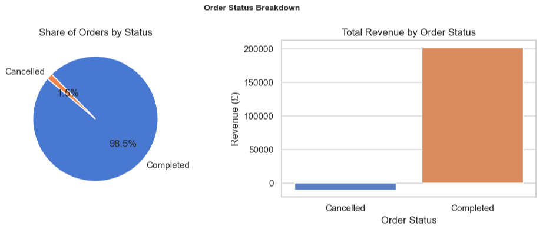
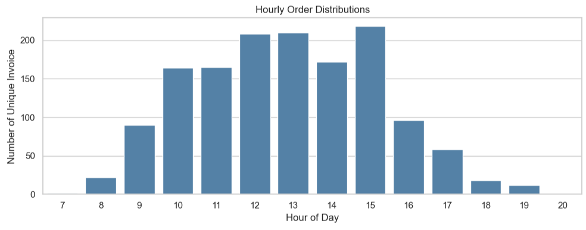
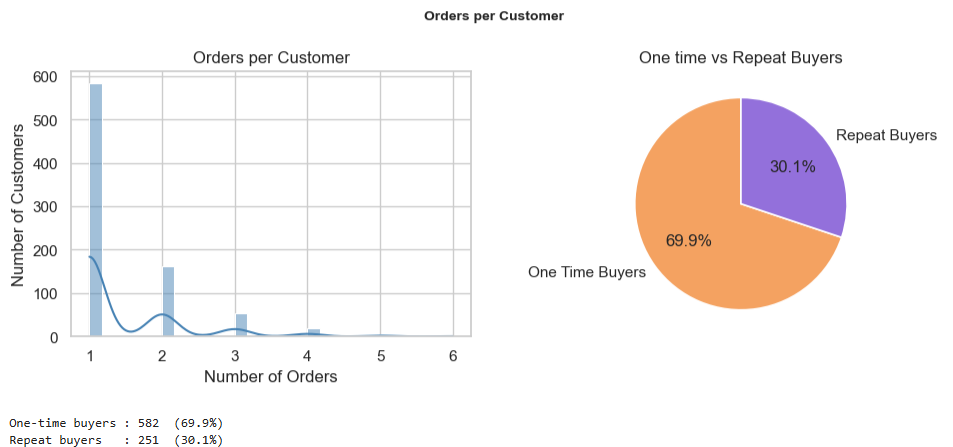
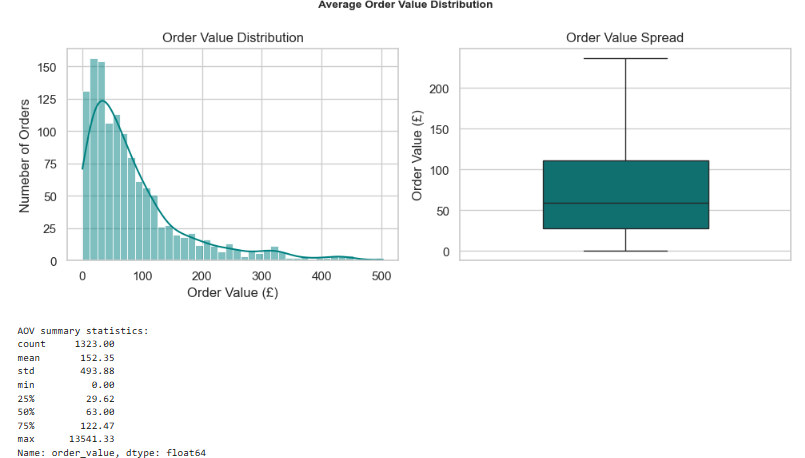

**Full Python Code:**
*[View Full Jupyter Notebook Code](python/EDA.ipynb)

---

## 3. Cohort Retention Analysis

Customers were grouped into weekly cohorts based on the week of their first purchase, then tracked across subsequent weeks to measure what percentage of each cohort kept buying.

**Method:** `Cohort_Index` = weeks elapsed since a customer's first purchase week; retention rate = active customers in week N ÷ original cohort size.

**Findings:**

- Retention drops sharply after week 0 across nearly all cohorts — consistent with the 69.9% one-time-buyer rate found in EDA, confirming that customer drop-off after a first purchase is the single biggest leak in the funnel, not a one-off data artifact.
- Cohort sizes (new customers per week) and the average retention curve are visualized to show both **acquisition volume** and **retention decay** side by side, which is the standard way growth teams diagnose whether a problem is "we're not getting customers" vs. "we're not keeping them."

**Business takeaway:** Acquisition isn't the bottleneck — retention is. A second-purchase incentive (e.g. a follow-up discount within 1–2 weeks of a first order) would likely have more revenue impact than spending more on acquisition.

**Code snippet — building the retention table:**

```python
Completed['InvoiceWeek'] = Completed['InvoiceDate'].dt.to_period('W')
Completed['Cohort_Week'] = Completed.groupby('Customer ID')['InvoiceWeek'].transform('min')
Completed['Cohort_Index'] = (Completed['InvoiceWeek'] - Completed['Cohort_Week']).apply(lambda x: x.n)

Cohort_Data = (
    Completed.groupby(['Cohort_Week', 'Cohort_Index'])['Customer ID']
              .nunique()
              .reset_index()
)
Cohort_Table = Cohort_Data.pivot(index='Cohort_Week', columns='Cohort_Index', values='Customer ID')

# Convert raw counts to retention percentages
Cohort_Size = Cohort_Table.iloc[:, 0]
Retention_Table = Cohort_Table.divide(Cohort_Size, axis=0) * 100
```

**Visuals:**

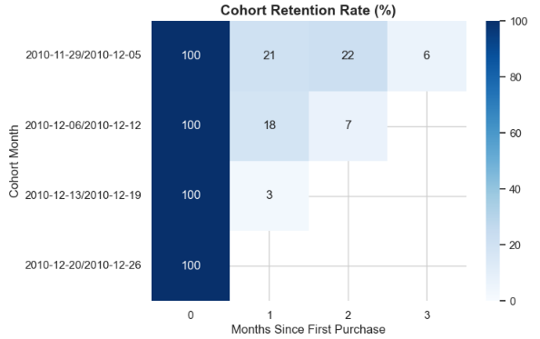
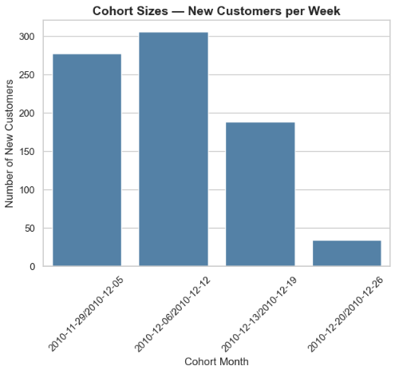
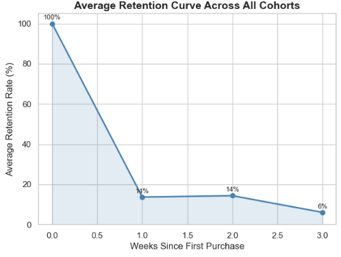

**Full Python Code:**
*[View Full Jupyter Notebook Code](python/CohortAnalysis.ipynb)

---

## 4. RFM Segmentation & K-Means Clustering

Two complementary approaches to customer segmentation were used deliberately, to compare a simple, explainable business rule against a data-driven unsupervised method.

### Rule-Based RFM Segmentation
Recency, Frequency, and Monetary value were each scored 1–4 by quartile, then combined into a human-readable segment:

- **VIP Customers** — top quartile across all three RFM dimensions
- **Big Spenders** — top quartile monetary value regardless of frequency/recency
- **Lost Customers** — bottom quartile recency and frequency (haven't bought in a while, never bought often)
- **Regular Customers** — everyone else

This segmentation is intentionally simple and easy to explain to a non-technical stakeholder or marketing team — every customer's segment can be justified in one sentence.

### Data-Driven K-Means Clustering
RFM values were log-transformed (to handle skew) and standardized, then clustered into 4 groups algorithmically (`k=4`, `random_state=42`).

| Cluster | Avg. Recency (days) | Avg. Frequency | Avg. Monetary (£) | Profile |
|---|---|---|---|---|
| Cluster 3 | 6.4 | 51.7 | 1,165.5 | Power buyers — extremely frequent, very high spend, very recent |
| Cluster 1 | 16.4 | 9.3 | 154.0 | Solid mid-tier, regularly engaged |
| Cluster 0 | 7.1 | 4.1 | 92.1 | Recent but light spenders |
| Cluster 2 | 17.0 | 2.4 | 39.2 | Lowest engagement, at risk |

**Why both methods:** The rule-based segments are interpretable and fast to act on; the K-Means clusters reveal a structure the manual rules missed — Cluster 3 (1.2% of average spend tier) is a genuinely distinct "power buyer" group worth a dedicated retention strategy, not just folded into "Big Spenders."

**Code snippet — RFM scoring and segment rules:**

```python
RFM['R_Score'] = pd.qcut(RFM['Recency'], q=4, labels=[4, 3, 2, 1])
RFM['F_Score'] = pd.qcut(RFM['Frequency'].rank(method='first'), q=4, labels=[1, 2, 3, 4])
RFM['M_Score'] = pd.qcut(RFM['Monetary'], q=4, labels=[1, 2, 3, 4])
RFM['RFM_Cell'] = RFM['R_Score'].astype(str) + RFM['F_Score'].astype(str) + RFM['M_Score'].astype(str)

def assign_simplified_segment(row):
    if row['RFM_Cell'] == '444':
        return 'VIP Customers'
    elif row['M_Score'] == 4:
        return 'Big Spenders'
    elif row['R_Score'] == 1 and row['F_Score'] == 1:
        return 'Lost Customers'
    else:
        return 'Regular Customers'

RFM['Segment'] = RFM.apply(assign_simplified_segment, axis=1)
```

**Code snippet — K-Means clustering on scaled RFM values:**

```python
RFM_log = np.log1p(RFM[['Recency', 'Frequency', 'Monetary']])
RFM_scaled = StandardScaler().fit_transform(RFM_log)

kmeans = KMeans(n_clusters=4, random_state=42, n_init=10)
kmeans.fit(RFM_scaled)
RFM['Cluster'] = kmeans.labels_
```

**Visuals:**

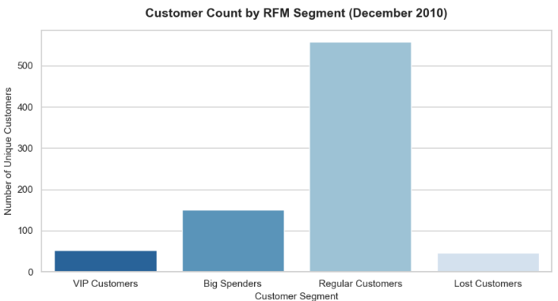
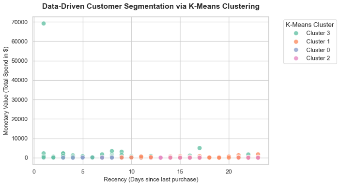

**Full Python Code:**
*[View Full Jupyter Notebook Code](python/RFMSegmentationandKMeansClustering.ipynb)

---

## 5. Cancellation Pattern Analysis

A focused investigation into the 153 cancelled transactions to understand who cancels, what they cancel, and when.

**Who cancels:**
Excluding guest/unidentified customers (Customer ID = 0, which accounted for the largest share of cancelled value at £6,996), the top identified canceller had £459.90 in cancelled value — meaning cancellations are spread across customers rather than driven by a single repeat offender.

**What gets cancelled:**
One product — the *Rotating Silver Angels T-Light Holder* — accounted for 9,369 cancelled units, vastly outweighing every other cancelled item (the next highest was 144 units of *Christmas Gingham Star*). This is a strong signal of either a data entry/bulk-order anomaly or a genuine product quality issue worth investigating with the merchandising team before being treated as routine churn.

**When cancellations happen:**
A daily cancellation trend across December shows cancellations are not evenly distributed — they spike on specific days rather than trickling in steadily, which is more consistent with bulk-order corrections or post-holiday-rush adjustments than random one-off customer regret.

**Code snippet — isolating and quantifying cancelled revenue:**

```python
Canceled = df[df['Order_Status'] == 'Cancelled'].copy()
Canceled['Revenue'] = (Canceled['Quantity'] * Canceled['Price']).abs()

top_cancel_products = (
    Canceled.assign(Abs_Quantity=Canceled['Quantity'].abs())
             .groupby('Description')['Abs_Quantity']
             .sum()
             .reset_index(name='Quantity')
             .sort_values(by='Quantity', ascending=False)
             .head(5)
)
```

**Visuals:**

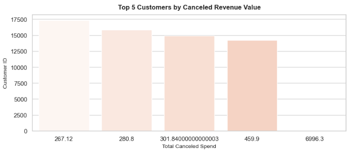
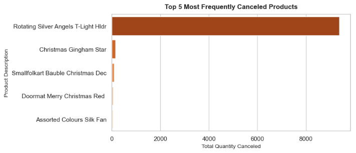
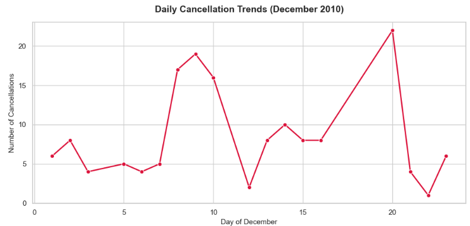

**Full Python Code:**
*[View Full Jupyter Notebook Code](python/CancellationPatterns.ipynb)

---

## 6. Predicting Cancellations with Logistic Regression

**Goal:** Use a customer's RFM profile to predict whether they are likely to have a cancelled order (`Will_Cancel`).

**Setup:** Logistic Regression with `class_weight='balanced'` to account for the fact that cancelling customers are a small minority of the customer base (806 customers total, 80/20 train-test split).

**Results:**

| Metric | Value |
|---|---|
| Overall Accuracy | 52.5% |
| Precision (Will Cancel) | 0.07 |
| Recall (Will Cancel) | 0.42 |
| F1-score (Will Cancel) | 0.11 |

**Honest interpretation:** This model does **not** perform well, and that's an important and deliberately reported finding rather than a hidden one. With only 12 cancelling customers in the test set and just three weak features (Recency, Frequency, Monetary), the model has too little signal and too little class balance to reliably predict cancellations. Accuracy near 53% with very low precision shows the model is barely better than guessing on the minority class — RFM alone is not predictive of cancellation behavior in this dataset.

**What this tells the business:** Cancellations in this dataset appear to be driven by factors outside basic purchase-recency-and-spend (e.g. the single outlier product identified in the cancellation pattern analysis), not by a customer being "high-risk" by RFM profile. A future iteration would need product-level features, order size, or time-of-purchase signals rather than relying on customer-level RFM alone.

**Code snippet — training the cancellation prediction model:**

```python
X = RFM[['Recency', 'Frequency', 'Monetary']].copy()
y = RFM['Will_Cancel'].copy()

X_train, X_test, y_train, y_test = train_test_split(X, y, test_size=0.20, random_state=42)

scaler = StandardScaler()
X_train_scaled = scaler.fit_transform(X_train)
X_test_scaled = scaler.transform(X_test)

model = LogisticRegression(random_state=42, class_weight='balanced')
model.fit(X_train_scaled, y_train)

predictions = model.predict(X_test_scaled)
print(f"Overall Model Accuracy: {accuracy_score(y_test, predictions):.1%}")
print(classification_report(y_test, predictions, target_names=['Will Complete', 'Will Cancel']))
```

**Visual:**


**Full Python Code:**
*[View Full Jupyter Notebook Code](python/LogisticRegression.ipynb)

---

## Key Business Recommendations

1. **Fix the post-first-purchase drop-off.** With 69.9% one-time buyers and retention falling sharply after week 0, a timed second-purchase incentive is likely the highest-leverage retention lever available.
2. **Build a dedicated retention play for the "power buyer" K-Means cluster** (Cluster 3) — they spend ~13x the lowest cluster and purchase ~21x more frequently; losing even a handful of them has outsized revenue impact.
3. **Investigate the Rotating Silver Angels T-Light Holder cancellation spike** as a product or fulfillment issue, not customer churn — it's the single largest signal in the entire cancellation dataset.
4. **Don't deploy the cancellation prediction model as-is.** It would need richer, order-level and product-level features before it's reliable enough to act on.

---

## How to Reproduce

1. Download the dataset from the [UCI Repository](https://archive.ics.uci.edu/dataset/502/online+retail+ii).
2. Run `01_OnlineRetail-DataCleaningFinal.ipynb` first — this produces the cleaned CSV every other notebook depends on.
3. Run notebooks 02–06 in any order; each reads independently from the cleaned CSV.

```bash
pip install pandas numpy matplotlib seaborn scikit-learn
```

---

## Related Work

This project is one component of a broader, tool-agnostic data analytics portfolio that independently demonstrates the same core competencies — data cleaning, EDA, segmentation, and storytelling — in SQL/Tableau, Excel, and Power BI as well.
